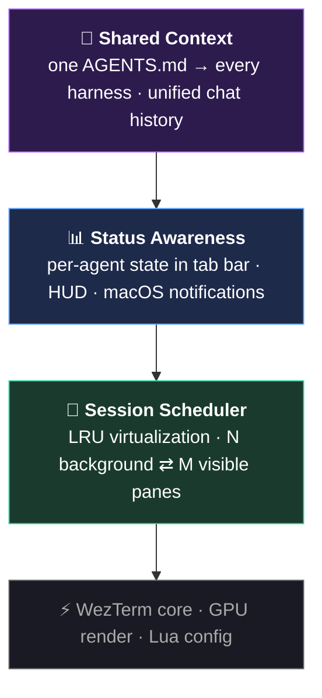

<div align="center">
  
  <h1>Helm 🎯</h1>
  <p><em>The first agent-native terminal. You steer — agents execute.</em></p>

  <p>
    <a href="LICENSE.md"></a>
    
    
    
  </p>
</div>

---

## What is Helm?

Helm is the **first agent-native terminal** for macOS. Run many AI agents in parallel; Helm handles the scheduling, status, and shared context so you only do the deciding.

Most terminals assume one human, one session. Helm assumes you are orchestrating a fleet of agents: they do the work, surface what needs you, and wait. You review and sign off. Zero friction.

## Philosophy: less friction

**Zero friction · Works out of the box · You focus on shipping tasks, agents do the rest.**

Helm removes the friction between you and your agents. No babysitting a terminal, no hunting for which pane needs your input, no losing your place switching tools. You ship tasks and make the calls; the agents do everything in between.

---

## The Agent OS

Helm adds three layers on top of a fast GPU terminal:



- **Session Scheduler** — keep 10 agents alive, show 2. Idle ones swap to the background; the one that needs you surfaces automatically.
- **Status Awareness** — every pane knows if its agent is working 🔵, waiting 🟠, or idle ⏸. Get notified the moment one needs input.
- **Shared Context** — one memory file, symlinked to every harness. Switch from Kiro to Claude Code mid-task; the context follows.

---

## The Brain 🧠 — meet your First Mate

Running ten agents still means watching ten panes. The Brain removes that last bit of friction: instead of juggling N agents, you talk to **one**.

The Brain is a Sonnet orchestrator — your **First Mate**. It watches every worker session for you (state + token usage), reports only when something actually needs you, and routes your instructions to the right pane. You say *"tell the one working on the parser to also add tests"*; the First Mate finds it and sends it — with a confirm gate before anything lands.

This is the **less friction** philosophy taken to its end: **N agents → 1 conversation**. You stop scanning a wall of terminals and start steering through a single mate who knows the whole crew.

Press `Cmd+Shift+Return` to toggle between the Brain view and your workers.

---

## Three views

Helm's UX is three views you flip between instantly — one keystroke each:

- **`Cmd+1` Brain** 🧠 — your First Mate orchestrator. Talk to one mate that watches the whole crew.
- **`Cmd+2` Workspace** 🛠️ — where you and your agents actually work.
- **`Cmd+3` Monitor** 📊 — an htop-style overview of every session: state, runtime, tokens.

Press `Cmd+/` to toggle a bottom help bar showing the current key bindings, so you never have to remember them.

---

## Install

```bash
curl -fsSL https://raw.githubusercontent.com/interesting-vibe-coding/helm/main/install.sh | bash
```

That's it. On first launch, Helm guides you through shell integration and sets up
cross-harness memory automatically. Then press `Cmd+Shift+K` to launch your first agent.

<details>
<summary>Build from source</summary>

```bash
git clone https://github.com/interesting-vibe-coding/helm
cd helm
PROFILE=debug ./scripts/build.sh --app-only
open dist/Helm.app
```
</details>

---

## Keyboard Shortcuts

| Shortcut | Action |
|----------|--------|
| `Cmd+1` | Brain view — your First Mate orchestrator |
| `Cmd+2` | Workspace view — where you and agents work |
| `Cmd+3` | Monitor view — htop-style list of every session |
| `Cmd+/` | Toggle the bottom help bar (key bindings) |
| `Cmd+Shift+Return` | Toggle between the Brain view and your workers |
| `Cmd+Shift+K` | Launch an agent (kiro / claude-code / opencode / codex) in a new pane |
| `Cmd+Shift+S` | Session list — all active agents with runtime + state |
| `Cmd+Shift+B` | Background the current session |
| `Cmd+Shift+M` | Toggle model (sonnet ↔ opus) in kiro |

---

## Why Helm?

| | Helm | tmux | cmux | Warp |
|---|:---:|:---:|:---:|:---:|
| Session scheduling (LRU) | ✅ | ❌ | ❌ | ❌ |
| Agent state in tab bar | ✅ | ❌ | 🔔 | ❌ |
| Cross-harness memory | ✅ auto | manual | ❌ | ❌ |
| Unified chat history | ✅ | ❌ | ❌ | ❌ |
| Native GPU render | ✅ | ❌ | ✅ | ❌ |
| Open source | ✅ | ✅ | ✅ | ❌ |

---

## Tools

Helm ships CLI tools for agent workflows (see [`tools/`](tools/)): `helm-history`, `helm-status`, `helm-watch`, `helm-doctor`, and more. Run `helm-doctor` to check your setup.

---

## Built On & Credits

Helm is a focused fork of **[Kaku](https://github.com/tw93/Kaku)** by [Tw93](https://github.com/tw93) (itself built on **[WezTerm](https://wezfurlong.org/wezterm/)**). Thank you 🙏 Inspired by **[Ghostty](https://ghostty.org)** and **[cmux](https://github.com/manaflow-ai/cmux)**.

macOS only (Apple Silicon + Intel). Rust + Lua. MIT licensed.

---

<div align="center">
  <sub>Part of <a href="https://github.com/interesting-vibe-coding">interesting-vibe-coding</a> — more fun agent tooling over there 🐾</sub>
</div>
