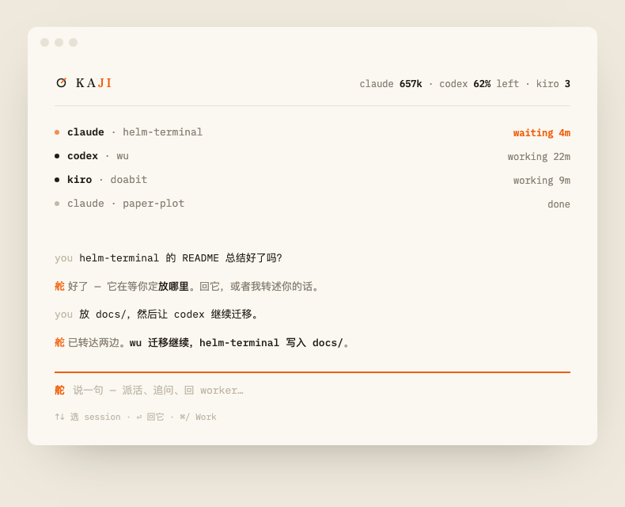

<div align="center">
  
  <h1>Kaji</h1>
  <p><em>Mission control for your AI coding agents — in the terminal, and in your pocket.</em></p>
  <p><a href="README.zh.md">中文</a></p>
</div>

---

Kaji runs a crew of coding agents — Claude Code, Kiro, opencode, Codex — side by side, and gives you one calm surface to steer them all: every worker visible at once, quota at a glance, and a phone page that works from anywhere. You hold the rudder (舵, *kaji*); the agents row.

> Your prefrontal cortex is finite.
> Stop spending it switching context between agents. `(ᴗ‿ᴗ)`



## Install

```bash
curl -fsSL https://raw.githubusercontent.com/interesting-vibe-coding/kaji/main/install.sh | bash
```

Open Kaji. Mission Control greets you. Say what to build.

## What you get

**Say it, don't manage it.** Mission Control opens on the helm line — type one
sentence (*"spin up codex in wu and fix the newsletter route"*), a small model
turns it into a plan, you confirm with arrow keys (or flip to auto mode with
`Tab`), and the worker is rowing. No forms, no flags.

**Two views, one key.** `Cmd+/` flips between **Mission Control** (the fleet,
the quota, the helm line) and **Work** (the worker you were just steering).
That's the whole navigation model. `Cmd+Shift+K` launches any harness;
workers tile side by side — claude next to codex next to kiro.

**A fleet you can read in one glance.** Kaji Sun, day and night: one persimmon
accent that means exactly one thing — *a worker needs you*. Working is ink,
done fades to ash. Every session shows how full its context window is
(`ctx 18%`) before it forgets your morning.

**Quota you can trust.** Real five-hour and weekly usage straight from the
providers' own endpoints (Claude OAuth usage API, Codex app-server) — on the
cockpit, the status bar, and your phone. Know before you burn the evening's
budget.

**Your fleet, from your phone.** `kaji-brain serve` + the built-in relay put
the same cockpit — helm line included — in your phone's browser over plain
HTTPS. No inbound ports on your Mac, no VPN slot on your phone, works behind
any proxy. See [docs/remote.md](docs/remote.md).

**Engine-agnostic by design.** The Brain is a thin service (CLI + HTTP + MCP)
over an append-only event substrate — not a model. Any harness can be a
worker; any client (terminal cockpit, phone, a script, an LLM if you want one)
can hold the rudder.

## Why this shape

Remote-control-your-agent is a crowded space — but every player locks you to
one vendor's agent. Kaji's bet is the opposite: the hard part isn't talking to
one agent, it's *running a fleet of different ones* without shredding your
attention. So the trunk is harness-agnostic fleet control with shared
memory — and the terminal it lives in is built for exactly that.

---

Built on the shoulders of [Kaku](https://github.com/tw93/Kaku),
[WezTerm](https://wezfurlong.org/wezterm/), and the push from
[Ghostty](https://ghostty.org). MIT — see [LICENSE.md](LICENSE.md).

<div align="center">
  <sub>Part of <a href="https://github.com/interesting-vibe-coding">interesting-vibe-coding</a> · MIT</sub>
</div>
